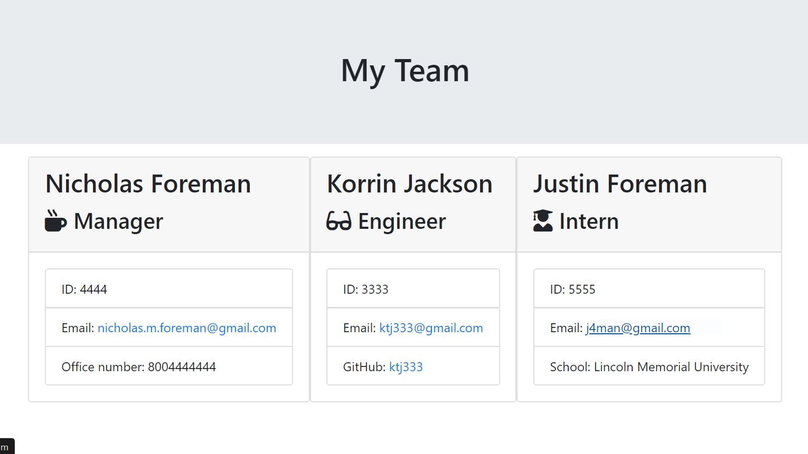

# Team Profile Generator
Unit 10 - Team Profile Generator

## Description

This is a Node CLI that takes in information about employees and generates an HTML webpage that displays summaries for each person.

The application will prompt the user for information about the team manager and then information about the team members. The user can input any number of team members, and they may be a mix of engineers and interns.

## Table of Contents

- [Installation](#Installation)
- [Usage](#Usage)
- [License](#License)
- [Contribution](#Contribution)
- [Testing](#Testing)
- [Questions](#Questions)

## Installation

NPM Install is required.

app.js - Runs the application

### Library Folder

This folder contains the different classes.

- Employee.js
- Engineer.js
- htmlRenderer.js
- Intern.js
- Manager.js

### Output Folder

This folder contains the rendered output.

- team.html

### Templates Folder

This folder contains the HTML templates.

- engineer.html
- intern.html
- main.html
- manager.html

### Test Folder

This folder is for the different jest tests.

- Employee.test.js
- Engineer.test.js
- Intern.test.js
- Manager.test.js

## Usage

## License

MIT License

Copyright (c) [2020] [Nicholas Foreman]

Permission is hereby granted, free of charge, to any person obtaining a copy
of this software and associated documentation files (the "Software"), to deal
in the Software without restriction, including without limitation the rights
to use, copy, modify, merge, publish, distribute, sublicense, and/or sell
copies of the Software, and to permit persons to whom the Software is
furnished to do so, subject to the following conditions:

The above copyright notice and this permission notice shall be included in all
copies or substantial portions of the Software.

THE SOFTWARE IS PROVIDED "AS IS", WITHOUT WARRANTY OF ANY KIND, EXPRESS OR
IMPLIED, INCLUDING BUT NOT LIMITED TO THE WARRANTIES OF MERCHANTABILITY,
FITNESS FOR A PARTICULAR PURPOSE AND NONINFRINGEMENT. IN NO EVENT SHALL THE
AUTHORS OR COPYRIGHT HOLDERS BE LIABLE FOR ANY CLAIM, DAMAGES OR OTHER
LIABILITY, WHETHER IN AN ACTION OF CONTRACT, TORT OR OTHERWISE, ARISING FROM,
OUT OF OR IN CONNECTION WITH THE SOFTWARE OR THE USE OR OTHER DEALINGS IN THE
SOFTWARE.

(https://img.shields.io/badge/license-MIT-blue.svg)

## Contribution

N/A

## Testing

NPM Test

## Questions

If you have any additional questions, feel free to contact me via email:
nicholas.m.foreman@gmail.com

* ![GitHub license] (https://img.shields.io/badge/license-MIT-blue.svg)